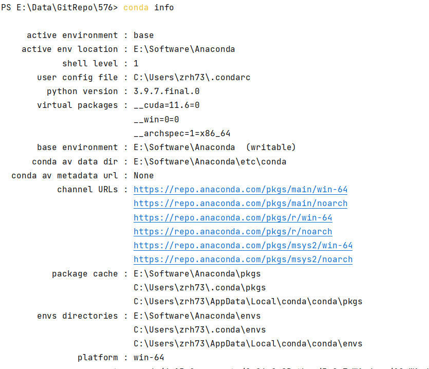
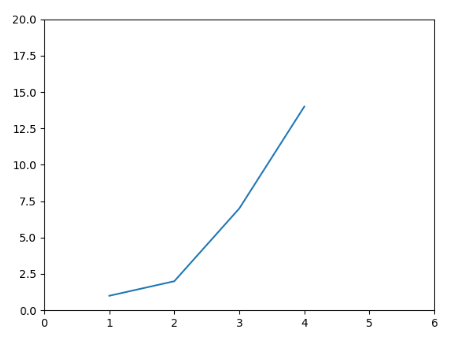
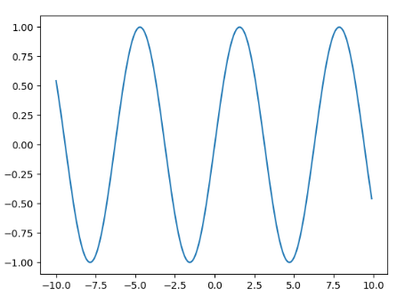

# Assigment 0

## Task 1




## Task 2

```python
import numpy as np
from numpy import linalg
```


```python
a = np.array([i for i in range(30)]).reshape(6,5)
block = np.block([[a,a],[a,a]])
print(a)
print(block)
```

    [[ 0  1  2  3  4]
     [ 5  6  7  8  9]
     [10 11 12 13 14]
     [15 16 17 18 19]
     [20 21 22 23 24]
     [25 26 27 28 29]]
    [[ 0  1  2  3  4  0  1  2  3  4]
     [ 5  6  7  8  9  5  6  7  8  9]
     [10 11 12 13 14 10 11 12 13 14]
     [15 16 17 18 19 15 16 17 18 19]
     [20 21 22 23 24 20 21 22 23 24]
     [25 26 27 28 29 25 26 27 28 29]
     [ 0  1  2  3  4  0  1  2  3  4]
     [ 5  6  7  8  9  5  6  7  8  9]
     [10 11 12 13 14 10 11 12 13 14]
     [15 16 17 18 19 15 16 17 18 19]
     [20 21 22 23 24 20 21 22 23 24]
     [25 26 27 28 29 25 26 27 28 29]]


```python
print("Dim: ", a.ndim)
print("Size: ", a.size)
print(f"Shape: {a.shape}")
print(f"Shape[1]: {a.shape[1]}")
```

    Dim:  2
    Size:  30
    Shape: (6, 5)
    Shape[1]: 5


```python
print(f"- a[-1]: \n{a[-1]}")
print(f"- a[1,4]: \n{a[1,4]}")
print(f"- a[1,:]: \n{a[1,:]}")
print(f"- a[0:3, :]: \n{a[:3, :]}")
print(f"- a[-5:]: \n{a[-5:]}")
print(f"- a[0:3, 3:]: \n{a[0:3, 3:]}")
print(f"- a[np.ix_([1, 3, 4], [0, 2])]: \n{a[np.ix_([1, 3, 4], [0, 2])]}")
print(f"- a[2:4:2],:]: \n{a[2:4:2, :]}")
print(f"- a[::2],:]: \n{a[::2, :]}")
print(f"a[::-1,:]: \n{a[::-1,:]}")
print(f"a[np.r_[:len(a),1]]: \n{a[np.r_[:len(a),1]]}")
```

    - a[-1]: 
    [25 26 27 28 29]
    - a[1,4]: 
    9
    - a[1,:]: 
    [5 6 7 8 9]
    - a[0:3, :]: 
    [[ 0  1  2  3  4]
     [ 5  6  7  8  9]
     [10 11 12 13 14]]
    - a[-5:]: 
    [[ 5  6  7  8  9]
     [10 11 12 13 14]
     [15 16 17 18 19]
     [20 21 22 23 24]
     [25 26 27 28 29]]
    - a[0:3, 3:]: 
    [[ 3  4]
     [ 8  9]
     [13 14]]
    - a[np.ix_([1, 3, 4], [0, 2])]: 
    [[ 5  7]
     [15 17]
     [20 22]]
    - a[2:4:2],:]: 
    [[10 11 12 13 14]]
    - a[::2],:]: 
    [[ 0  1  2  3  4]
     [10 11 12 13 14]
     [20 21 22 23 24]]
    a[::-1,:]: 
    [[25 26 27 28 29]
     [20 21 22 23 24]
     [15 16 17 18 19]
     [10 11 12 13 14]
     [ 5  6  7  8  9]
     [ 0  1  2  3  4]]
    a[np.r_[:len(a),1]]: 
    [[ 0  1  2  3  4]
     [ 5  6  7  8  9]
     [10 11 12 13 14]
     [15 16 17 18 19]
     [20 21 22 23 24]
     [25 26 27 28 29]
     [ 5  6  7  8  9]]


```python
print(f"a.T: \n{a.T}")
print(f"a.conj().T: \n{a.conj().T}")
```

    a.T: 
    [[ 0  5 10 15 20 25]
     [ 1  6 11 16 21 26]
     [ 2  7 12 17 22 27]
     [ 3  8 13 18 23 28]
     [ 4  9 14 19 24 29]]
    a.conj().T: 
    [[ 0  5 10 15 20 25]
     [ 1  6 11 16 21 26]
     [ 2  7 12 17 22 27]
     [ 3  8 13 18 23 28]
     [ 4  9 14 19 24 29]]


```python
b = np.array([[3,1],[2,4]])
c = np.array([[1],[2]])
v = np.array([0,1])
print(f"- b @ c: \n{b @ c}")
print(f"- b * c: \n{b * c}")
print(f"- b / c: \n{b / c}")
print(f"- b**3: \n{b ** 3}")
print(f"- (b > 0.5): \n {(b > 0.5)}")
print(f"- np.nonzero(b > 0.5): \n{np.nonzero(b > 0.5)}")
print(f"- b[:,np.nonzero(v > 0.5)[0]]: \n{b[:,np.nonzero(v > 0.5)[0]]}")
print(f"- b[:, v.T > 0.5]: \n{b[:, v.T > 0.5]}")
print(f"- b[b > 2]: \n{b[b>2]}")
print(f"- b * (b > 2): \n{b * (b > 2)}")
```

    - b @ c: 
    [[ 5]
     [10]]
    - b * c: 
    [[3 1]
     [4 8]]
    - b / c: 
    [[3. 1.]
     [1. 2.]]
    - b**3: 
    [[27  1]
     [ 8 64]]
    - (b > 0.5): 
     [[ True  True]
     [ True  True]]
    - np.nonzero(b > 0.5): 
    (array([0, 0, 1, 1], dtype=int64), array([0, 1, 0, 1], dtype=int64))
    - b[:,np.nonzero(v > 0.5)[0]]: 
    [[1]
     [4]]
    - b[:, v.T > 0.5]: 
    [[1]
     [4]]
    - b[b > 2]: 
    [3 4]
    - b * (b > 2): 
    [[3 0]
     [0 4]]


```python
y = b.copy()
print(f"- y: \n{y}")
print(f"- y = b[1,:].copy(): \n{b[1,:].copy()}")
print(f"y=b.flatten(): \n{b.flatten()}")
```

    - y: 
    [[3 1]
     [2 4]]
    - y = b[1,:].copy(): 
    [2 4]
    y=b.flatten(): 
    [3 1 2 4]


```python
print(f"- np.arange(1., 11.): \n{np.arange(1., 11.)}")
print(f"- np.arange(10.): \n{np.arange(10.)}")
print(f"- np.arange(1.,11.)[:, np.newaxis]: \n{np.arange(1.,11.)[:, np.newaxis]}")
print(f"- np.zeros((3, 4)): \n{np.zeros((3, 4))}")
print(f"- np.zeros((3, 4, 5)): \n{np.zeros((3, 4, 5))}")
print(f"- np.ones((3, 4)): \n{np.ones((3, 4))}")
print(f"- np.eye(3):\n{np.eye(3)}")
print(f"- np.diag(a): \n{np.diag(a)}")
print(f"- np.diag(v, 0):\n{np.diag(v, 0)}")
print(f"- np.random.rand(3, 4)):\n{np.random.rand(3, 4)}")
print(f"- np.linspace(1,3,4):\n{np.linspace(1,3,4)}")
```

    - np.arange(1., 11.): 
    [ 1.  2.  3.  4.  5.  6.  7.  8.  9. 10.]
    - np.arange(10.): 
    [0. 1. 2. 3. 4. 5. 6. 7. 8. 9.]
    - np.arange(1.,11.)[:, np.newaxis]: 
    [[ 1.]
     [ 2.]
     [ 3.]
     [ 4.]
     [ 5.]
     [ 6.]
     [ 7.]
     [ 8.]
     [ 9.]
     [10.]]
    - np.zeros((3, 4)): 
    [[0. 0. 0. 0.]
     [0. 0. 0. 0.]
     [0. 0. 0. 0.]]
    - np.zeros((3, 4, 5)): 
    [[[0. 0. 0. 0. 0.]
      [0. 0. 0. 0. 0.]
      [0. 0. 0. 0. 0.]
      [0. 0. 0. 0. 0.]]
    
     [[0. 0. 0. 0. 0.]
      [0. 0. 0. 0. 0.]
      [0. 0. 0. 0. 0.]
      [0. 0. 0. 0. 0.]]
    
     [[0. 0. 0. 0. 0.]
      [0. 0. 0. 0. 0.]
      [0. 0. 0. 0. 0.]
      [0. 0. 0. 0. 0.]]]
    - np.ones((3, 4)): 
    [[1. 1. 1. 1.]
     [1. 1. 1. 1.]
     [1. 1. 1. 1.]]
    - np.eye(3):
    [[1. 0. 0.]
     [0. 1. 0.]
     [0. 0. 1.]]
    - np.diag(a): 
    [ 0  6 12 18 24]
    - np.diag(v, 0):
    [[0 0]
     [0 1]]
    - np.random.rand(3, 4)):
    [[0.95786033 0.97750282 0.58263052 0.96759798]
     [0.96030918 0.40089222 0.93854563 0.15034803]
     [0.40565058 0.45035103 0.85098553 0.04857567]]
    - np.linspace(1,3,4):
    [1.         1.66666667 2.33333333 3.        ]


```python
print(f"- np.mgrid[0:9.,0:6.]:\n{np.mgrid[0:9.,0:6.]}")
print(f"- ogrid[0:9.,0:6.]:\n{np.ogrid[0:9.,0:6.]}")
print(f"- np.meshgrid([1,2,4],[2,4,5]):\n{np.meshgrid([1,2,4],[2,4,5])}")
print(f"- np.ix_([1,2,4],[2,4,5]):\n{np.ix_([1,2,4],[2,4,5])}")
print(f"- np.tile(a, (m, n)):\n{np.tile(a, (2, 3))}")
```

    - np.mgrid[0:9.,0:6.]:
    [[[0. 0. 0. 0. 0. 0.]
      [1. 1. 1. 1. 1. 1.]
      [2. 2. 2. 2. 2. 2.]
      [3. 3. 3. 3. 3. 3.]
      [4. 4. 4. 4. 4. 4.]
      [5. 5. 5. 5. 5. 5.]
      [6. 6. 6. 6. 6. 6.]
      [7. 7. 7. 7. 7. 7.]
      [8. 8. 8. 8. 8. 8.]]
    
     [[0. 1. 2. 3. 4. 5.]
      [0. 1. 2. 3. 4. 5.]
      [0. 1. 2. 3. 4. 5.]
      [0. 1. 2. 3. 4. 5.]
      [0. 1. 2. 3. 4. 5.]
      [0. 1. 2. 3. 4. 5.]
      [0. 1. 2. 3. 4. 5.]
      [0. 1. 2. 3. 4. 5.]
      [0. 1. 2. 3. 4. 5.]]]
    - ogrid[0:9.,0:6.]:
    [array([[0.],
           [1.],
           [2.],
           [3.],
           [4.],
           [5.],
           [6.],
           [7.],
           [8.]]), array([[0., 1., 2., 3., 4., 5.]])]
    - np.meshgrid([1,2,4],[2,4,5]):
    [array([[1, 2, 4],
           [1, 2, 4],
           [1, 2, 4]]), array([[2, 2, 2],
           [4, 4, 4],
           [5, 5, 5]])]
    - np.ix_([1,2,4],[2,4,5]):
    (array([[1],
           [2],
           [4]]), array([[2, 4, 5]]))
    - np.tile(a, (m, n)):
    [[ 0  1  2  3  4  0  1  2  3  4  0  1  2  3  4]
     [ 5  6  7  8  9  5  6  7  8  9  5  6  7  8  9]
     [10 11 12 13 14 10 11 12 13 14 10 11 12 13 14]
     [15 16 17 18 19 15 16 17 18 19 15 16 17 18 19]
     [20 21 22 23 24 20 21 22 23 24 20 21 22 23 24]
     [25 26 27 28 29 25 26 27 28 29 25 26 27 28 29]
     [ 0  1  2  3  4  0  1  2  3  4  0  1  2  3  4]
     [ 5  6  7  8  9  5  6  7  8  9  5  6  7  8  9]
     [10 11 12 13 14 10 11 12 13 14 10 11 12 13 14]
     [15 16 17 18 19 15 16 17 18 19 15 16 17 18 19]
     [20 21 22 23 24 20 21 22 23 24 20 21 22 23 24]
     [25 26 27 28 29 25 26 27 28 29 25 26 27 28 29]]


```python
a = np.array([[0],[4]])
b = np.array([[2],[3]])
print(f"- np.concatenate((a,b),1):\n{np.hstack((a,b))}")
print(f"- np.vstack((a,b)):\n{np.vstack((a,b))}")
```

    - np.concatenate((a,b),1):
    [[0 2]
     [4 3]]
    - np.vstack((a,b)):
    [[0]
     [4]
     [2]
     [3]]


```python
print(f"- a.max():\n{a.max()}")
print(f"- a.max(0):\n{a.max(0)}")
print(f"- a.max(1):\n{a.max(1)}")
print(f"- np.maximum(a, b):\n{np.maximum(a, b)}")
print(f"- logical_and(a,b):\n{np.logical_and(a,b)}")
print(f"- np.logical_or(a,b):\n{np.logical_or(a,b)}")
print(f"- a&b:\n{a&b}")
print(f"- a|b:\n{a|b}")
```

    - a.max():
    4
    - a.max(0):
    [4]
    - a.max(1):
    [0 4]
    - np.maximum(a, b):
    [[2]
     [4]]
    - logical_and(a,b):
    [[False]
     [ True]]
    - np.logical_or(a,b):
    [[ True]
     [ True]]
    - a&b:
    [[0]
     [0]]
    - a|b:
    [[2]
     [7]]


```python
v = np.array([1,2,3])
print(f"- np.linalg.norm(v):\n{np.linalg.norm(v)}")
```

    - np.linalg.norm(v):
    3.7416573867739413


```python
a = np.array([[2,3],[5,7]])
b = np.array([7,10])
print(f"- linalg.inv(a):\n{np.linalg.inv(a)}")
print(f"- linalg.pinv(a):\n{np.linalg.pinv(a)}")
print(f"- np.linalg.matrix_rank(a):\n{np.linalg.matrix_rank(a)}")
print(f"- linalg.solve(a, b):\n{np.linalg.solve(a, b)}")
U,S, Vh = np.linalg.svd(a)
print(f"- linalg.svd(a):\n{U}\n{S}\n{Vh}")
```

    - linalg.inv(a):
    [[-7.  3.]
     [ 5. -2.]]
    - linalg.pinv(a):
    [[-7.  3.]
     [ 5. -2.]]
    - np.linalg.matrix_rank(a):
    2
    - linalg.solve(a, b):
    [-19.  15.]
    - linalg.svd(a):
    [[-0.38643579 -0.92231631]
     [-0.92231631  0.38643579]]
    [9.32676279 0.10721834]
    [[-0.57731211 -0.81652356]
     [ 0.81652356 -0.57731211]]


```python
D,V = linalg.eig(a)
print(f"- linalg.eig(a):\n{D}\n{V}")

a = np.eye(5)
print(f"- linalg.cholesky(a):\n{np.linalg.cholesky(a)}")

Q,R = linalg.qr(a)
print(f"- linalg.qr(a):\n{Q}\n{R}")
```

    - linalg.eig(a):
    [-0.10977223  9.10977223]
    [[-0.81797819 -0.38876264]
     [ 0.57524923 -0.92133794]]
    - linalg.cholesky(a):
    [[1. 0. 0. 0. 0.]
     [0. 1. 0. 0. 0.]
     [0. 0. 1. 0. 0.]
     [0. 0. 0. 1. 0.]
     [0. 0. 0. 0. 1.]]
    - linalg.qr(a):
    [[1. 0. 0. 0. 0.]
     [0. 1. 0. 0. 0.]
     [0. 0. 1. 0. 0.]
     [0. 0. 0. 1. 0.]
     [0. 0. 0. 0. 1.]]
    [[1. 0. 0. 0. 0.]
     [0. 1. 0. 0. 0.]
     [0. 0. 1. 0. 0.]
     [0. 0. 0. 1. 0.]
     [0. 0. 0. 0. 1.]]


```python
print(f"- fft:\n{np.fft.fft(a)}")
print(f"- ifft:\n{np.fft.ifft(a)}")
```

    - fft:
    [[ 1.        +0.j          1.        +0.j          1.        +0.j
       1.        +0.j          1.        +0.j        ]
     [ 1.        +0.j          0.30901699-0.95105652j -0.80901699-0.58778525j
      -0.80901699+0.58778525j  0.30901699+0.95105652j]
     [ 1.        +0.j         -0.80901699-0.58778525j  0.30901699+0.95105652j
       0.30901699-0.95105652j -0.80901699+0.58778525j]
     [ 1.        +0.j         -0.80901699+0.58778525j  0.30901699-0.95105652j
       0.30901699+0.95105652j -0.80901699-0.58778525j]
     [ 1.        +0.j          0.30901699+0.95105652j -0.80901699+0.58778525j
      -0.80901699-0.58778525j  0.30901699-0.95105652j]]
    - ifft:
    [[ 0.2      +0.j          0.2      +0.j          0.2      +0.j
       0.2      +0.j          0.2      +0.j        ]
     [ 0.2      +0.j          0.0618034+0.1902113j  -0.1618034+0.11755705j
      -0.1618034-0.11755705j  0.0618034-0.1902113j ]
     [ 0.2      +0.j         -0.1618034+0.11755705j  0.0618034-0.1902113j
       0.0618034+0.1902113j  -0.1618034-0.11755705j]
     [ 0.2      +0.j         -0.1618034-0.11755705j  0.0618034+0.1902113j
       0.0618034-0.1902113j  -0.1618034+0.11755705j]
     [ 0.2      +0.j          0.0618034-0.1902113j  -0.1618034-0.11755705j
      -0.1618034+0.11755705j  0.0618034+0.1902113j ]]


```python
a = np.array([[46,2,7,20],[65,90,30,12]])
print(f"- sort:\n{np.sort(a,axis=0)}")
print(f"- argsort:\n{np.argsort(a, axis=1)}")
print(f"uniqe:\n{np.unique(a)}")

a = a[...,None]
a = a.squeeze()
print(f"squeeze:\n{a.shape}")
```

    - sort:
    [[46  2  7 12]
     [65 90 30 20]]
    - argsort:
    [[1 2 3 0]
     [3 2 0 1]]
    uniqe:
    [ 2  7 12 20 30 46 65 90]
    squeeze:
    (2, 4)


```python
Z = np.array([[2,5],[3,6],[9,10],[10,15]])
y = np.array([3,4,7,10])
x = linalg.lstsq(Z,y)
print(f"linalg.lstsq(Z, y):\n{x}")
```

    linalg.lstsq(Z, y):
    (array([0.14836601, 0.56797386]), array([0.04052288]), 2, array([23.97238523,  2.30754121]))


## Task 3




## Task 4

```python
import numpy as np
import matplotlib.pyplot as plt

x = np.arange(-10,10,0.1)
y = lambda e: np.sin(e)
plt.plot(x, [y(i) for i in x])
plt.show()
```





## Task 5

My Github account: [obsismc](https://github.com/ObsisMc)


## Task 6

