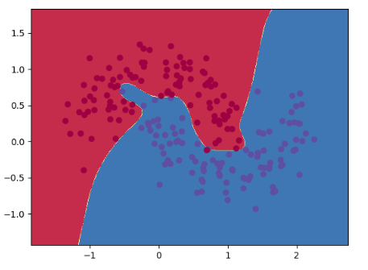

## Q1 Backpropagation in a Simple Neural Network

### Time to Have Fun -Training

##### Training with `nn_hidden_dim=3` in `three_layer_neural_network.py`

**Tanh**


**Sigmoid**


**Relu**


`tanh` and `sigmoid` have more smooth decision boundary than `relu` because the curves of the former two are smooth and `relu`'s curve isn't smooth at 0.


##### Training with `nn_hidden_dim>3` and `tanh` in `three_layer_neural_network.py`

**nn_hidden_dim == 3**


**nn_hidden_dim == 5**


**nn_hidden_dim == 10**



**nn_hidden_dim == 15**


**nn_hidden_dim == 20**


As  hidden dimension increases, the decision boundary becomes rugged and less smooth. It is because the model can learn more details and more complex cases when hidden dimension increases. However, after `nn_hidden_dim > 5`, the boundary doesn't change much, which maybe mean that 5 dimension is enough to handle this problem.


### Even More Fun - Training a Deeper Network

#### Code Explanation

I encapsulate the fully connected layer and the activation function into  `LinearLayer` and `ActivationLayer` separately. 

**LinearLayer**

```python
class LinearLayer:
    def __init__(self, input_dim, output_dim):
        self.input_dim = input_dim
        self.output_dim = output_dim

        # np.random.seed(seed)
        self.W = np.random.randn(self.input_dim, self.output_dim) / np.sqrt(self.input_dim)
        self.bias = np.zeros((1, self.output_dim))
        self.dW = self.db = None

        self.X = None

    def feedforward(self, X):
        self.X = np.copy(X)
        return X @ self.W + self.bias

    def backprop(self, grad):
        self.dW = self.X.T @ grad
        self.db = grad.mean(axis=0)
        dX = grad @ self.W.T
        return dX
```

I encapsulate weights, bias, input of the layer (which will be used when calculating gradients) and gradients of weights and bias in the `LinearLayer` so the whole layer can be decoupled from `DeepNeuralNetwork`.

`backprop(self, grad)` get gradient of the last layer and output gradient of current layer to next layer. 

**ActivationLayer**

```python
class ActivationLayer:
    def __init__(self, tp: str):
        assert tp in ["relu", "sigmoid", "tanh", "identity"]
        self.tp = tp
        self.z = None

    def feedforward(self, z):
        self.z = np.copy(z)
        if self.tp.lower() == "relu":
            z[z < 0] = 0
            return z
        elif self.tp.lower() == "sigmoid":
            return 1 / (1 + np.e ** (-z))
        elif self.tp.lower() == "tanh":
            return (np.e ** z - np.e ** (-z)) / (np.e ** z + np.e ** (-z))
        elif self.tp.lower() == "identity":
            return z

    def backprop(self, grad):
        if self.tp.lower() == "relu":
            d = np.ones_like(self.z)
            d[self.z < 0] = 0
        elif self.tp.lower() == "sigmoid":
            d = np.copy(self.z)
            d = np.e ** (-d) / (1 + np.e ** (-d)) ** 2
        elif self.tp.lower() == "tanh":
            d = np.copy(self.z)
            d = 1 - ((np.e ** d - np.e ** (-d)) / (np.e ** d + np.e ** (-d))) ** 2
        else:
            d = np.ones_like(self.z)
        return grad * d
```

I also decouple the activation function from `DeepNeuralNetwork`. I also set a `identity` activation function to make the code of `DeepNeuralNetwork`'s feedforward/backprop more elegant and cleaner.

**DeepNeuralNetwork**

1. `__init__`

```python
def __init__(self, nn_input_dim: int, 
                 nn_output_dim, 
                 nn_hidden_dim, # dimension of hidden layers
                 layer_num, # the total number of layers, including input & output layers
                 actFun_type='tanh', 
                 reg_lambda=0.01,
                 seed=0):
    assert layer_num >= 3
    ...
    # initialize the weights and biases in the network
    np.random.seed(seed)
    self.fcs = [LinearLayer(self.layer_dims[i], self.layer_dims[i + 1]) for i in range(self.layer_num - 1)]
    self.activations = [ActivationLayer(self.actFun_type) for _ in range(self.layer_num - 2)]
    self.activations.append(ActivationLayer("identity"))
```

The whole network can receive `nn_hidden_dim` and `layer_num` to set layer size and the number of layers separately. In my implementation, the number of layers contains input and output layers rather than only hidden layers.

I let the number of layers `layer_num` greater than 2 so there is at least 1 hidden layer. Then, there are `layer_num - 2` linear layers and  `layer_num - 2` activation functions (the last activation function is `identity`).

2. `feedforward`

```python
def feedforward(self, X):
    # YOU IMPLEMENT YOUR feedforward HERE
    for i, (fc, act) in enumerate(zip(self.fcs, self.activations)):
        X = fc.feedforward(X)
        X = act.feedforward(X)
    exp_scores = np.exp(X - np.max(X, axis=1, keepdims=True))
   	self.probs = exp_scores / np.sum(exp_scores, axis=1, keepdims=True)
    return self.probs
```

Feedforward `X` like the code above. To avoid overflow of value, I subtract `np.max(X,axis=1)` from each sample, which won't change the value of `self.probs`.

In my implementation, I set a `Identity` activation function after the output layer so the code of  `feedforward` and `backprop`  can be cleaner and simpler, which won't influence the output and the backpropagation. 

3. `backprop`

   ```python
   def backprop(self, X, y):
       # IMPLEMENT YOUR BACKPROP HERE
       num_examples = len(X)
       da = self.probs  # (n,2)
       da[range(num_examples), y] -= 1  # (n,2)
   
       for i, (fc, act) in enumerate(zip(self.fcs[::-1], self.activations[::-1])):
           dz = act.backprop(da)
           da = fc.backprop(dz)
   ```

Just the chain rule of neural network. I calculate gradients from the last layer to the first layer.

Again, in my implementation, I set a `Identity` activation function after the output layer to make the code clean, which won't impact the backpropagation.

4. `calculate_loss`

   ```python
   def calculate_loss(self, X, y):
   	num_examples = len(X)
       self.feedforward(X)
       # Calculating the loss
       data_loss = - np.sum(np.log(self.probs[range(num_examples), y]+1e-5))
       print(f'Accuary: {np.sum(self.probs.argmax(axis=1) == y) / len(y)}')
   
       # Add regulatization term to loss (optional)
       for fc in self.fcs:
           data_loss += self.reg_lambda / 2 * (np.sum(np.square(fc.W)))
       return (1. / num_examples) * data_loss
   ```

   I add a small value to the softmax result to make sure there is no `np.log(0)`. Then,  I add regularization to loss.

4. `fit_model`

```python
def fit_model(self, X, y, epsilon=0.01, num_passes=20000, print_loss=True):
    # Gradient descent.
    for i in range(0, num_passes):
        # Forward propagation
        self.feedforward(X)
        # Backpropagation
        self.backprop(X, y)

        for fi, fc in enumerate(self.fcs):
            fc.W += -epsilon * (fc.dW + self.reg_lambda * fc.W)
            fc.bias += -epsilon * fc.db
     	...
```

After `backprop`, update parameters of each layer.

  

##### More tests on `Make_Moons` dataset

**nn_hidden_dim=3, layer_num=3, tanh**


**nn_hidden_dim=3, layer_num=5, tanh**


**nn_hidden_dim=5, layer_num=5, tanh**


**nn_hidden_dim=5, layer_num=10, tanh**


**nn_hidden_dim=10, layer_num=3, tanh**


**nn_hidden_dim=10, layer_num=5, tanh**


When the number of layers is big and hidden dimension is small, the performance isn't good. When the number of layer and hidden dimension are both large, the performance will increase. When hidden dimension is small, increasing hidden dimension can bring more improvement than increasing the number of layers.


##### Tests on `Make_blobs` dataset

```python
make_blobs(n_samples=200, 
           n_features=2, 
           centers=2, 
           cluster_std=1.0, 
           center_box=(-10.0, 10.0),
           shuffle=True, random_state=None)
```


I use another dataset `make_blobs` to train my model. There are 200 points and 2 clusters.

The data is simple and the two clusters can almost split by a linear decision boundary but there are still some points hard to classify.


**nn_hidden_dim=3, layer_num=3, tanh**


**nn_hidden_dim=3, layer_num=5, tanh**


**nn_hidden_dim=5, layer_num=3, tanh**


**nn_hidden_dim=5, layer_num=5, tanh**


When hidden dimension and the number of layers are small, the decision boundary is like a linear boundary. However, when the two parameters increase, we can see the model can output complex boundaries. When configuration is `nn_hidden_dim=5, layer_num=5, tanh`, the model can classify all points correctly.


## Q2 Training a Simple Deep Convolutional Network on MNIST

#### Result of Question (a)

Test accuracy

Test loss


Train loss


#### Result of Question (b) & (c)

I add more visualizations to monitor more statistics like min, max, standard deviation of weights and biases of each layer. And I also monitor test error after each 1100 iterations.

In addition, I test `Adagrad` optimization and `tanh` and `Leakyrelu` activations. In the following figures, lines with different colors stand for different training algorithms. The orange one uses `relu` and `adam`; the red one uses `relu` and `adagrad`; the navy blue one uses `Leakyrelu` and `adagrad`; the light blue one uses `tanh` and `adagrad`.

##### training and test result


##### layers' statistics

**Conv1**


histograms


**Conv2**


histograms


**fc1**


histograms


**fc2**


histograms


According to the figures, I find that `adagrad` is better than `adam` in this case. Model with `adagrad` optimization will learn a more uniform weight and the histogram will be more smooth. In addition, `relu` has the best performance.