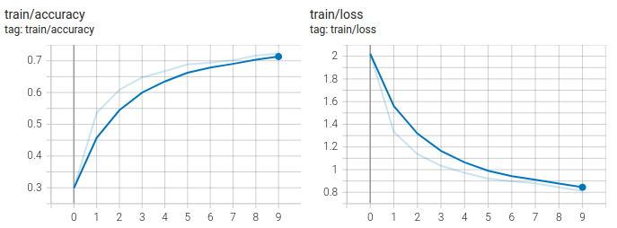
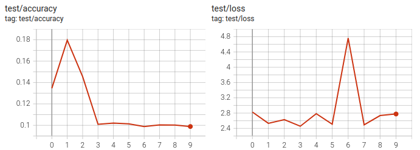

# Assignment 2

## CNN with CIFAR10

### Train & Test

I trained it with different learning rate, optimizer and epochs.

I tried the following parameters:

| Parameters    | value1 | value2  | value3 |
| ------------- | ------ | ------- | ------ |
| learning rate | 0.001  | 0.005   | 0.01   |
| optimizer     | Adam   | Adagrad |        |
| epochs        | 10     | 20      |        |

Then, I found `learning rate=0.01, optimizer=Adagrad, epochs=20` can get the best result with testing loss `0.8578` and testing accuracy `0.717`.

##### learning rate=0.001 & optimizer=Adam & epochs=10

|       | Best Loss | Best Accuracy |
| ----- | --------- | ------------- |
| Train | 0.9583    | 0.6667        |
| Test  | 1.04      | 0.6423        |

##### learning rate=0.005 & optimizer=Adam & epochs=10

|       | Best Loss | Best Accuracy |
| ----- | --------- | ------------- |
| Train | 0.813     | 0.7229        |
| Test  | 1.168     | 0.6409        |

##### learning rate=0.01 & optimizer=Adam & epochs=10

|       | Best Loss | Best Accuracy |
| ----- | --------- | ------------- |
| Train | 2.576     | 0.136         |
| Test  | 2.493     | 0.1796        |

##### learning rate=0.001 & optimizer=Adagrad & epochs=10

|       | Best Loss | Best Accuracy |
| ----- | --------- | ------------- |
| Train | 1.204     | 0.5852        |
| Test  | 1.242     | 0.5678        |

##### learning rate=0.005 & optimizer=Adagrad & epochs=10

|       | Best Loss | Best Accuracy |
| ----- | --------- | ------------- |
| Train | 0.8916    | 0.6942        |
| Test  | 1.009     | 0.651         |

##### learning rate=0.01 & optimizer=Adagrad & epochs=10

|       | Best Loss | Best Accuracy |
| ----- | --------- | ------------- |
| Train | 0.5843    | 0.8122        |
| Test  | 0.9117    | 0.6848        |

##### learning rate=0.01 & optimizer=Adam & epochs=20

|       | Best Loss | Best Accuracy |
| ----- | --------- | ------------- |
| Train | 0.1498    | 0.9816        |
| Test  | 0.8578    | 0.717         |

### Visualization

I write `visualize.py` to visualize the weight using `visualize_weight()` and get statistics of activations using `show_activation_statistics()`

Visualization of the first convolutional layer's weights:

The statistics of activations:

| activations | mean   | std    |
| ----------- | ------ | ------ |
| ReLU1       | 0.0657 | 0.1373 |
| ReLU2       | 0.1000 | 0.3112 |

## Paper Understanding

This paper seeks to explore why large convolutional neural network models perform exceptionally well and looks into potential improvements. The authors introduce a new way to visualize the inner workings of intermediate feature layers and the classifier. Their fresh visualization technique uses a multi-layered Deconvolutional Network (deconvnet) to show feature activations in a way that's easier to understand. In the paper, the authors use standard supervised convnet models that process a 2D color image through several layers to make a probability estimate. The upper layers of the network are traditional fully-connected networks, and the final layer acts as a kind of decision-maker. To understand what's happening in each layer, the authors introduce a unique method for translating these activities into something more recognizable, revealing the original patterns in the input that are related to specific features. To study a convnet, they connect a deconvnet to each layer and apply a series of steps, including unpooling, adjusting, and filtering, to reconstruct the activities in each layer until they get back to the input image. The model was trained using the ImageNet 2012 training set with some adjustments. Furthermore, the authors show how the model can work well on other datasets trained on ImageNet by using the deconvnet to visualize feature activations in the ImageNet validation set. This paper makes valuable contributions to understanding features, how they change during training, and their consistency. It also has implications for choosing network architectures, understanding how different parts relate, and analyzing what happens when parts are hidden.

## RNN with MNIST

### RNN & LSTM & GRU

I tried the following parameters in `RNN`, `LSTM` and `GRU`.

| parameters    | value1 | value2  |
| ------------- | ------ | ------- |
| learning rate | 0.01   | 0.001   |
| hidden size   | 64     | 128     |
| optimizer     | adam   | adagrad |

`LSTM` and `GRU` are more stable than `RNN`. Since `RNN` is simpler than `LSTM` and `GRU`, it can be easily effected by some noise during training, which results in violent oscillation of training curves.

In my experiments, `GRU` with `learning rate=0.001, hidden size=128, optimizer=Adam`has the best result: testing loss `0.03123` and testing accuracy `0.9906`.

#### RNN

##### learning rate=0.01 & optimizer=Adam & hidden size=128

|       | Best Loss | Best Accuracy |
| ----- | --------- | ------------- |
| Train | 2.283     | 0.7516        |
| Test  | 1.43      | 0.8378        |

##### learning rate=0.001 & optimizer=Adam & hidden size=128

|       | Best Loss | Best Accuracy |
| ----- | --------- | ------------- |
| Train | 0.06867   | 0.9801        |
| Test  | 0.06329   | 0.9818        |

### 

##### learning rate=0.001 & optimizer=Adam & hidden size=64

|       | Best Loss | Best Accuracy |
| ----- | --------- | ------------- |
| Train | 0.198     | 0.9415        |
| Test  | 0.1934    | 0.9432        |

### 

##### learning rate=0.01 & optimizer=Adagrad & hidden size=128

|       | Best Loss | Best Accuracy |
| ----- | --------- | ------------- |
| Train | 0.09433   | 0.9727        |
| Test  | 0.08647   | 0.9737        |

### 

#### LSTM

##### learning rate=0.01 & optimizer=Adam & hidden size=128

|       | Best Loss | Best Accuracy |
| ----- | --------- | ------------- |
| Train | 0.06987   | 0.9791        |
| Test  | 0.07299   | 0.9776        |

### 

##### learning rate=0.001 & optimizer=Adam & hidden size=128

|       | Best Loss | Best Accuracy |
| ----- | --------- | ------------- |
| Train | 0.02253   | 0.9932        |
| Test  | 0.03677   | 0.9895        |

### 

##### learning rate=0.001 & optimizer=Adam & hidden size=64

|       | Best Loss | Best Accuracy |
| ----- | --------- | ------------- |
| Train | 0.0291    | 0.9907        |
| Test  | 0.04606   | 0.9863        |

### 

##### learning rate=0.01 & optimizer=Adagrad & hidden size=128

|       | Best Loss | Best Accuracy |
| ----- | --------- | ------------- |
| Train | 0.03298   | 0.99          |
| Test  | 0.05173   | 0.9847        |

### 

#### GRU

##### learning rate=0.01 & optimizer=Adam & hidden size=128

|       | Best Loss | Best Accuracy |
| ----- | --------- | ------------- |
| Train | 0.198     | 0.9415        |
| Test  | 0.1934    | 0.9432        |

### 

##### learning rate=0.001 & optimizer=Adam & hidden size=128

|       | Best Loss | Best Accuracy |
| ----- | --------- | ------------- |
| Train | 0.01871   | 0.9939        |
| Test  | 0.03123   | 0.9906        |

### 

##### learning rate=0.001 & optimizer=Adam & hidden size=64

|       | Best Loss | Best Accuracy |
| ----- | --------- | ------------- |
| Train | 0.02437   | 0.9923        |
| Test  | 0.04349   | 0.9871        |

### 

##### learning rate=0.01 & optimizer=Adagrad & hidden size=128

##### 

|       | Best Loss | Best Accuracy |
| ----- | --------- | ------------- |
| Train | 0.03559   | 0.9897        |
| Test  | 0.04811   | 0.9862        |

### Comparison with CNN

- Similarities
  - They both use idea of gradient updating to find the optimal solutions and can be trained using the same approach
  - They both can be used in many areas like object recognition
- Differences
  - CNN needs input with fixed shape, while RNN can get input of variable length
  - In general, CNN aims to solve image problems, while RNN aims to solve sequence problems like text and time series
  - RNN captures temporal information, while CNN captures spatial information

